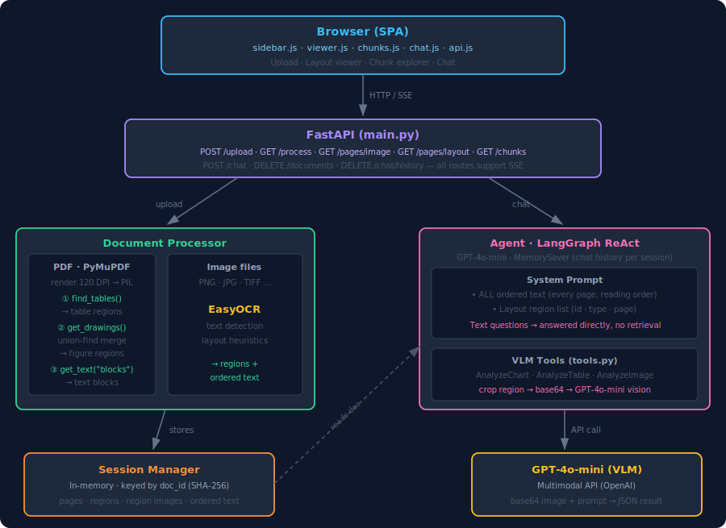

# Document Intelligence Agent

A FastAPI + vanilla JS web app that lets you upload PDFs or images, inspect their layout regions (tables, figures, text), browse extracted text chunks, and chat with an AI agent that reads the document text and visually analyzes charts and tables using GPT-4o-mini.


---

## Features

- **Drag-and-drop upload** with live SSE progress bar
- **Document viewer** — page image with colored bounding-box overlays for each detected region (table / figure / text)
- **Chunk explorer** — searchable table of all text blocks extracted in reading order
- **Chat** — LangGraph ReAct agent answers questions; tool calls (AnalyzeChart, AnalyzeTable, AnalyzeImage) are shown inline as collapsible cards
- **Dark mode** toggle

---

## Architecture



**Color legend:** blue = frontend · purple = API · green = document processing · pink = agent · orange = session storage · yellow = AI model

**Flow summary:**
- **Upload path** (left): Browser → FastAPI → Document Processor → Session Manager
- **Chat path** (right): Browser → FastAPI → Agent (reads from Session) → VLM tools → GPT-4o-mini
- **Dashed arrow**: Agent reads the processed document from Session Manager on every chat request

---

## Project Structure

```
document-intelligence-agent/
├── main.py                  # FastAPI entry point
├── config.py                # Model names + VLM prompt templates
├── models.py                # Pydantic models (ProcessedDocument, etc.)
├── utils.py                 # compute_file_hash, image_to_base64, crop_region
├── document_processor.py    # PDF/image → List[DocumentPage]
├── ocr.py                   # EasyOCR wrapper (image files only)
├── layout.py                # Layout detection for image files
├── agent.py                 # LangGraph agent factory + stream_agent()
├── tools.py                 # AnalyzeChart / AnalyzeTable / AnalyzeImage
├── backend/
│   ├── session.py           # In-memory SessionManager
│   ├── serializers.py       # Models → JSON-safe dicts
│   └── routes/
│       ├── documents.py     # Upload, process (SSE), pages, layout, regions
│       ├── chat.py          # Chat endpoint with SSE streaming
│       └── chunks.py        # Chunk explorer API
├── static/
│   ├── index.html           # SPA shell
│   ├── css/styles.css       # Design system (CSS variables + dark mode)
│   └── js/
│       ├── api.js           # Fetch wrappers + SSE parser
│       ├── app.js           # State management, tab switching
│       └── components/
│           ├── sidebar.js   # Drag-drop upload + document list
│           ├── viewer.js    # Page image + SVG region overlays
│           ├── chunks.js    # Searchable chunk table
│           └── chat.js      # Message bubbles + tool call cards
├── requirements.txt
├── .env.example
└── .gitignore
```

---

## Setup

### 1. Clone and create virtual environment

```bash
git clone https://github.com/your-username/document-intelligence-agent.git
cd document-intelligence-agent
python -m venv venv

# Windows:
venv\Scripts\activate
# Linux/macOS:
source venv/bin/activate
```

### 2. Install dependencies

```bash
pip install -r requirements.txt
```

> EasyOCR auto-downloads a ~100 MB model on first use with an image file. PDF files use PyMuPDF's built-in text extraction — no model download needed.

### 3. Set your OpenAI API key

```bash
cp .env.example .env
# then edit .env:
# OPENAI_API_KEY=sk-...
```

### 4. Run

```bash
# Windows:
venv\Scripts\uvicorn.exe main:app --reload

# Linux/macOS:
uvicorn main:app --reload
```   

Open `http://localhost:8000`.

---

## API Reference

| Method | Path | Description |
|--------|------|-------------|
| `POST` | `/api/documents/upload` | Upload file → `{doc_id, filename}` |
| `GET` | `/api/documents/{id}/process` | SSE: processing progress |
| `GET` | `/api/documents` | List loaded documents |
| `GET` | `/api/documents/{id}` | Document metadata |
| `GET` | `/api/documents/{id}/pages/{n}/image` | Page image (PNG) |
| `GET` | `/api/documents/{id}/pages/{n}/layout` | Layout regions JSON |
| `GET` | `/api/documents/{id}/pages/{n}/regions/{rid}/image` | Cropped region PNG |
| `DELETE` | `/api/documents/{id}` | Delete document |
| `GET` | `/api/documents/{id}/chunks` | Text chunks (`?page=N&search=text`) |
| `POST` | `/api/chat` | SSE: chat with agent |
| `DELETE` | `/api/chat/history` | Clear chat history (`?session_id=X`) |

### SSE Event Types

**Processing stream:**
```
event: ping      data: {}
event: progress  data: {"pct": 0.5, "msg": "Processing page 3/6…"}
event: done      data: {"doc_id": "abc123"}
event: error     data: {"message": "…"}
```

**Chat stream:**
```
event: tool_call    data: {"name": "AnalyzeChart", "args": {"region_id": 2, "page_number": 1}}
event: tool_result  data: {"name": "AnalyzeChart", "result": "{\"chart_type\": \"bar\", …}"}
event: answer       data: {"content": "The chart shows quarterly revenue…"}
event: done         data: {}
event: error        data: {"message": "…"}
```

---

## Embedding a Demo Video

GitHub README supports MP4/MOV/WebM video files embedded directly — no YouTube needed.

1. Edit `README.md` on GitHub.com
2. Drag-and-drop your `.mp4` file (up to 100 MB) into the editor text area
3. GitHub uploads it and inserts a link like:
   ```
   https://github.com/user-attachments/assets/xxxxxxxx-xxxx-xxxx-xxxx-xxxxxxxxxxxx
   ```
4. This renders as an inline video player in the README.

---

## Supported File Types

| Format | Processing method |
|--------|------------------|
| PDF | PyMuPDF — native text + `find_tables()` + vector drawing detection |
| PNG, JPG, JPEG, TIFF, BMP, WebP | EasyOCR text detection + layout heuristics |

## Models Used

| Purpose | Model |
|---------|-------|
| Agent reasoning | `gpt-4o-mini` |
| Visual analysis (VLM) | `gpt-4o-mini` multimodal |

No local weights needed for PDFs. EasyOCR downloads ~100 MB on first image-file use.
